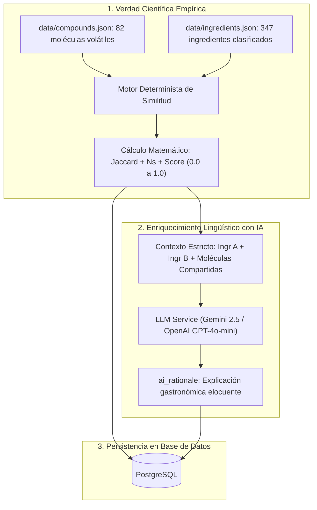

# Justificación Teórica y Metodológica del Score de Afinidad y Empirismo Químico

Este documento establece las bases científicas, formulación matemática y arquitectura de datos del proyecto **"Mapa de Sabores"**. Define la separación estricta entre la **verdad empírica molecular** (química de aromas) y el **enriquecimiento organoléptico asistido por Inteligencia Artificial**.

---

## 1. Fundamentos Científicos: La Hipótesis del Food Pairing

Históricamente, la cocina y la combinación de ingredientes se han considerado un arte basado exclusivamente en la tradición cultural y el ensayo empírico. Sin embargo, la ciencia de los alimentos contemporánea formalizó el principio del maridaje molecular a través de dos hitos fundamentales:

1. **Ahn et al. (Nature Scientific Reports, 2011)**: _"Flavor network and the principles of food pairing"_.
   - El estudio demostró que los ingredientes que comparten compuestos químicos volátiles de sabor/aroma tienden a combinarse con éxito (particularmente prevalente en las cocinas de Europa occidental y Norteamérica).
   - Se modeló la cocina como un **grafo bipartito** de ingredientes y moléculas de aroma, a partir del cual se proyecta la red de ingredientes y sus enlaces ponderados por solapamiento químico.
2. **FlavorDB (IIIT-Delhi, 2017)**:
   - Base de datos exhaustiva que cataloga más de 25.000 moléculas de aroma asociadas a ingredientes naturales y clasifica sus descriptores sensoriales (olor y gusto), estructuras y perfiles fisicoquímicos.

En **Mapa de Sabores**, adoptamos este paradigma: **ninguna afinidad entre ingredientes es producto de la invención o alucinación de un modelo de lenguaje**. Toda arista de afinidad en la base de datos se deriva de datos moleculares comprobables.

---

## 2. Modelado Matemático del Score de Afinidad

Cada ingrediente $i$ posee un conjunto de compuestos aromáticos volátiles identificados:
$$C_i = \{c_{i,1}, c_{i,2}, \dots, c_{i,m}\}$$

Para cualquier par de ingredientes $(A, B)$, definimos las siguientes propiedades deterministas:

### 2.1. Recuento Absoluto de Moléculas Compartidas ($N_s$)

$$N_s(A, B) = |C_A \cap C_B|$$
Representa la cantidad de moléculas químicas que ambos ingredientes tienen en común. En la literatura de Ahn et al., el peso de la arista en la red no dirigida se basa fundamentalmente en $N_s$.

### 2.2. Similitud de Jaccard ($J$)

Para normalizar la afinidad considerando el tamaño del perfil molecular de cada ingrediente (evitando que ingredientes con muchas moléculas dominen artificialmente sobre ingredientes de perfiles concentrados), se utiliza el coeficiente de similitud de Jaccard:
$$J(A, B) = \frac{|C_A \cap C_B|}{|C_A \cup C_B|} \in [0.00, 1.00]$$

Donde:

- $|C_A \cap C_B|$ es el número de compuestos compartidos.
- $|C_A \cup C_B|$ es el total de compuestos únicos presentes en la unión de ambos perfiles.
- Si $C_A \cup C_B = \emptyset$, entonces $J(A, B) = 0.00$.

### 2.3. Formulación del Score de Afinidad en Mapa de Sabores ($S_{AB}$)

Para proporcionar una métrica intuitiva en el rango $[0.00, 1.00]$ que equilibre tanto la **proporción de coincidencia** (Jaccard) como la **fuerza absoluta del puente aromático** ($N_s$), el score de afinidad se calcula determinísticamente como:

$$S(A, B) = \min\left(1.00, \; \alpha \cdot J(A, B) + (1 - \alpha) \cdot \frac{\min(N_s(A, B), N_{cap})}{N_{cap}}\right)$$

Con los hiperparámetros de calibración empírica:

- $\alpha = 0.50$ (ponderación equilibrada entre especificidad y volumen molecular).
- $N_{cap} = 6$ (saturación en 6 moléculas compartidas, umbral donde el puente aromático es extremadamente potente en la química de alimentos).

#### Clasificación del Score:

- **Alta Afinidad / Maridaje Molecular Fuerte ($S \ge 0.65$):** Comparten un núcleo olfativo idéntico o muy cercano (ej. Café + Chocolate, Tomate + Albahaca, Res + Tocino).
- **Afinidad Moderada / Armonía Complementaria ($0.45 \le S < 0.65$):** Comparten 2-3 compuestos clave que actúan como puente sutil (ej. Manzana + Canela mediante _linalool_ y ésteres frutales).
- **Baja Afinidad / Contraste / Discordante ($0.15 \le S < 0.45$):** Solapamiento mínimo o nulo; preservados selectivamente para el modo antagónico o "peores maridajes".
- **Descarte de Piso ($S < 0.15$ sin significancia culinaria):** Pares sin afinidad química ni tradición gastronómica, descartados para optimizar el tamaño del grafo.

---

## 3. Catálogo Molecular de Referencia

El sistema opera sobre un catálogo de **82 compuestos aromáticos volátiles** agrupados en 15 familias químicas funcionales:

| Familia Química          | Ejemplo de Moléculas                                       | Descriptores Sensoriales Clave                              |
| :----------------------- | :--------------------------------------------------------- | :---------------------------------------------------------- |
| **Terpenos**             | Linalool, Limoneno, Mirceno, Pineno, Geraniol              | Floral, lavanda, cítrico, resinoso, herbal                  |
| **Fenoles**              | Eugenol, Timol, Guayacol, 4-Vinilguayacol                  | Clavo, ahumado, especiado, tomillo, medicinal               |
| **Aldehídos**            | Cinamaldehído, Vainillina, Benzaldehído, Hexanal           | Canela, vainilla, almendra, verde/pasto, graso              |
| **Ésteres**              | Butirato de etilo, Acetato de isoamilo, Hexanoato de etilo | Frutal, ananá, banana, manzana, vino                        |
| **Cetonas**              | Diacetilo, Acetoína, Damascenona, Ionona, Zingerona        | Mantecoso, lácteo, manzana cocida, violeta, jengibre        |
| **Compuestos Azufrados** | Alicina, Disulfuro de dialilo, Dimetilsulfuro, Tiofeno     | Ajo pungente, cebolla cocida, trufa, cárnico, umami         |
| **Pirazinas**            | Metoxipirazina, Metilpirazina, Acetilpirazina              | Pimiento verde, tostado, nuez, pochoclo, cacao              |
| **Lactonas**             | Gamma-decalactona, Gamma-octalactona, Whiskey lactona      | Durazno, cremoso, coco, roble amaderado                     |
| **Ácidos**               | Ácido acético, Ácido cítrico, Ácido málico, Ácido butírico | Vinagre, punzante, cítrico, manzana ácida, queso maduro     |
| **Alcoholes**            | 1-Octen-3-ol, Alcohol fenetílico, Geosmina, Mentol         | Hongo terroso, rosa, miel, tierra húmeda (petricor), mentol |

---

## 4. Separación de Responsabilidades: Dataset vs. Inteligencia Artificial

Para garantizar la integridad científica del proyecto y cumplir con las directivas de arquitectura, el rol de cada componente está rígidamente delimitado:

### Reglas Inviolables del Sistema:

1. **La IA NUNCA inventa una afinidad**: El valor de `affinity_score` almacenado en `flavor_pairings` proviene del cálculo matemático sobre el dataset, no de un juicio arbitrario del LLM.
2. **La IA NUNCA inventa compuestos compartidos**: El prompt que se envía al LLM incluye explícitamente la lista de moléculas volátiles compartidas provenientes de `data/ingredients.json`. La IA únicamente traduce esa evidencia físico-química en un párrafo gastronómico atractivo para el usuario.
3. **Reproducibilidad Total**: Si se ejecuta el pipeline sin conexión a internet ni LLM (modo `--dry-run` o `offline`), el grafo de afinidades se genera idéntico en su totalidad a nivel cuantitativo.

---

## 5. Justificación Bromatológica Detallada por Matriz y Procesamiento

Para aquellas matrices complejas, cortes anatómicos especializados o alimentos elaborados que requieren una deducción cinética y espectrométrica precisa (más allá de los registros botánicos directos de FlavorDB), se han generado monografías técnicas específicas:

- **Cortes y Perfiles Vacunos:** [`docs/datos_carne.md`](./datos_carne.md) (diferenciación entre cortes magros, grasos y ricos en colágeno según cinética de cocción y volátiles Maillard/Strecker).
- **Dulce de Leche:** [`docs/datos_ddl.md`](./datos_ddl.md) (catálisis alcalina de Maillard, caramelización y ciclación de lactonas lácteas).
- **Salsa de Ostras:** [`docs/datos_salsa_ostras.md`](./datos_salsa_ostras.md) (hidrólisis de péptidos bivalvos, osmoprotectores marinos DMS/TMA y concentración caramelizada).
- **Proteína de Soja Texturizada:** [`docs/datos_soja_texturizada.md`](./datos_soja_texturizada.md) (termocizallamiento en extrusor, cinética de lipoxigenasa y formación de red fibrilar).

