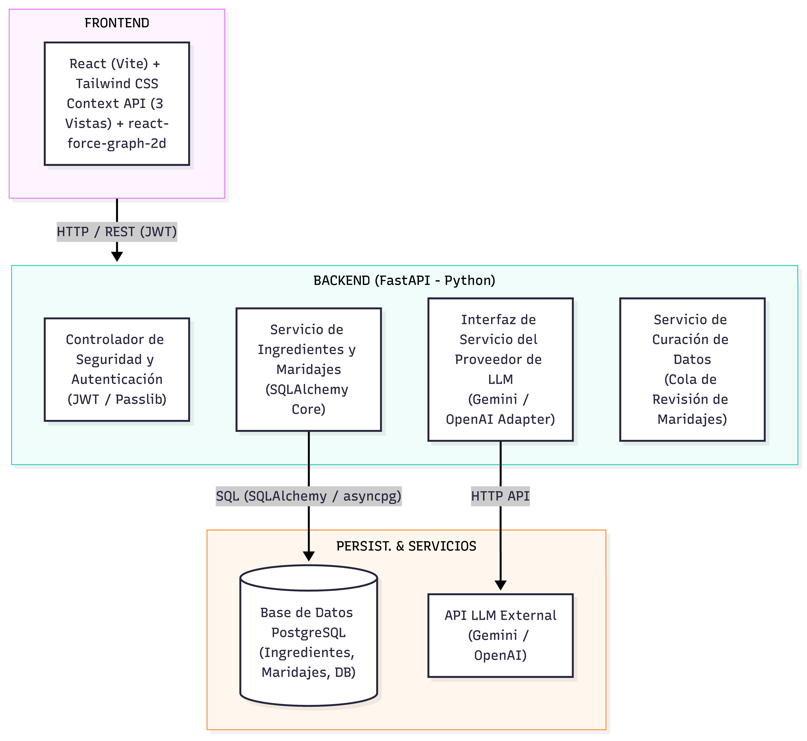
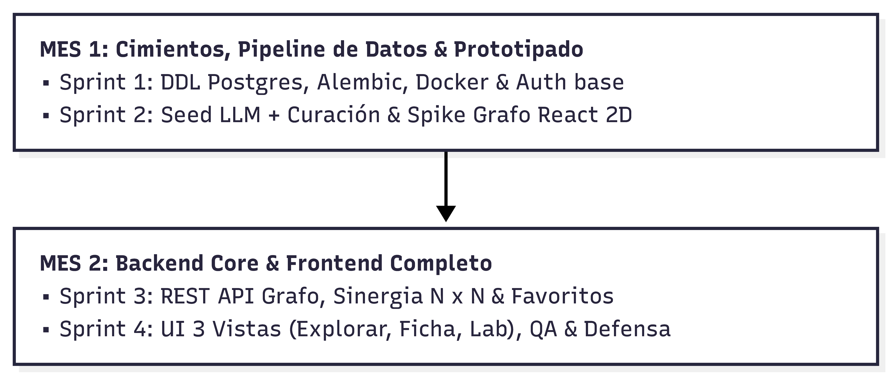

# Anteproyecto: Mapa de Sabores

> _ISFT 204 / Tecnicatura Superior en Desarrollo de Software_\
_Desarrollo de Sistemas Web - Prof. Adriana Morichetti_\
_Alumno: Diego Rafael Guaraz_

<!-- --- -->

## 1. Tema o Idea del Proyecto

**Tema:** Plataforma web interactiva para la exploración gastronómica y combinación de ingredientes (_flavor pairing_) mediante grafos visuales en 2D y asistencia de Inteligencia Artificial.

**Mapa de Sabores** permite a estudiantes de gastronomía, cocineros aficionados, sommeliers y curiosos de la cocina explorar de manera intuitiva y visual la red de afinidades entre ingredientes, recibiendo explicaciones en lenguaje natural generadas por un modelo de lenguaje (LLM) y evaluando la sinergia de combinaciones propias.

## 2. Identificación del Problema

El maridaje de ingredientes se suele resolver por intuición, prueba y error, o consultando enciclopedias culinarias estáticas (listas o libros). No existen herramientas web en español que permitan explorar esas relaciones de forma visual, mediante un grafo interactivo, con explicaciones y evaluación de combinaciones de varios ingredientes a la vez.

Esto afecta a los usuarios reales: un estudiante de gastronomía quiere entender por qué combinan dos ingredientes en lugar de memorizar recetas, un cocinero aficionado quiere encontrar alternativas cuando le falta un ingrediente sin revisar recetas ya armadas, y alguien simplemente curioso quiere descubrir relaciones —incluidas las que no funcionan— sin que la herramienta le imponga una sola respuesta. Los recursos que existen hoy (blogs, sitios de recetas, enciclopedias en inglés) no cubren esto: muestran texto estático o recetas cerradas, y no dejan explorar ni ver también qué combinaciones no funcionan.

## 3. Título del Anteproyecto

_"Mapa de Sabores – Sistema Web Interactivo de Descubrimiento Gastronómico asistido por Inteligencia Artificial"_

## 4. Formulación del Problema

**Pregunta de Investigación / Formulación:** ¿Cómo desarrollar una aplicación web _full-stack_ abierta e interactiva que permita explorar visualmente redes de maridaje entre ingredientes —incluyendo tanto afinidades favorables como desfavorables— y evaluar combinaciones culinarias propias en tiempo real, sin depender de recetas cerradas ni de fuentes estáticas en otros idiomas?

## 5. Objetivo General

**Desarrollar** una aplicación web _full-stack_ funcional e interactiva que permita explorar redes de sabores e interacciones entre ingredientes asistida por Inteligencia Artificial, estructurada en tres vistas principales, garantizando consistencia y respuestas instantáneas en la navegación.

## 6. Objetivos Específicos

1. Diseñar un esquema relacional optimizado en PostgreSQL para modelar grafos bidireccionales de afinidad entre ingredientes, resolviendo consultas de vecinos mediante índices compuestos y la restricción ordenada `ingredient_a_id < ingredient_b_id`.
2. Implementar un pipeline offline en Python para la síntesis de un dataset inicial de afinidades culinarias (~200-250 ingredientes y ~1.000-1.500 relaciones) asistido por un LLM en modo JSON estructurado, incorporando validación automática y una cola de revisión manual para los pares dudosos.
3. Desarrollar una API REST en FastAPI con arquitectura limpia, abstracción del proveedor de IA, y cálculo determinístico de sinergia entre N ingredientes.
4. Construir una interfaz de usuario interactiva en React estructurada en tres vistas principales: exploración del grafo, ficha de detalle de ingrediente, y laboratorio de combinaciones.
5. Integrar autenticación segura de usuarios (JWT) para permitir el registro, inicio de sesión y guardado de combinaciones favoritas.

## 7. Alcance del Proyecto

### 7.1 Funcionalidades Incluidas (MVP — 4 Sprints / 2 Meses)

* **Vista de Exploración (Grafo):** visualización interactiva en Canvas a 60 FPS, con selector Mejores/Todas/Peores, slider de cantidad de nodos (5-20) y botón "Explorar extremos".
* **Vista de Ficha de Ingrediente:** barras horizontales del perfil sensorial (dulce, ácido, salado, amargo, umami, aromático), ranking de mejores/peores afinidades, y tabla comparativa de perfiles al seleccionar un par específico.
* **Vista de Laboratorio:** constructor de combinaciones por etiquetas interactivas (_chips_), medidor de sinergia global (0-100%), matriz cruzada de afinidades, y alerta de ingrediente discordante con sugerencia de reemplazo por IA.
* **Servicio de IA online con fallback:** explicación en lenguaje natural de una combinación, generada bajo demanda con _timeout_ de 3 segundos y respaldo automático a texto pre-generado.
* **Autenticación y perfil:** registro, inicio de sesión y guardado de combinaciones favoritas.

Como requerimientos funcionales concretos, el sistema debe permitir: registrar una cuenta e iniciar sesión; explorar un grafo interactivo de ingredientes con sus afinidades más altas y más bajas; ver la ficha de un ingrediente con su perfil sensorial y sus mejores/peores combinaciones; armar una combinación de 2 a 10 ingredientes y calcular su sinergia grupal, su matriz de afinidades cruzadas y su ingrediente discordante; generar una explicación en lenguaje natural de por qué una combinación funciona o no; sugerir un reemplazo para el ingrediente discordante; y guardar/recuperar combinaciones favoritas de un usuario registrado.

### 7.2 Exclusiones del Alcance (Trabajo Futuro)

* **Integración con una API externa de recetas** (ej. Spoonacular): se descarta para el MVP, para proteger cuotas de uso y mantener el sistema enfocado en la red de maridajes.
* **Automatización CI/CD** (GitHub Actions): las pruebas se ejecutan localmente en esta etapa.
* **Control de varianza del dataset contra fuentes académicas externas** (FlavorDB/Flavornet): requiere resolver el _matching_ de nombres de ingredientes entre idiomas, y se difiere a una etapa posterior.
* **Sugerencias automáticas de qué ingrediente sumar a una combinación en el Laboratorio:** a diferencia del resto del Laboratorio, esto no sale de un simple orden sobre datos existentes sino que requiere agregación nueva sobre todos los pares posibles contra el grupo seleccionado y un criterio propio de "mejor sugerencia". Queda marcada como opcional para el último sprint si sobra tiempo, pero no es un entregable comprometido del MVP.

## 8. Usuarios y Actores

* **Usuario final gastronómico (anónimo o registrado):** estudiantes de gastronomía, cocineros aficionados, sommeliers y curiosos de la cocina. Exploran el grafo, consultan perfiles sensoriales, construyen combinaciones en el laboratorio y, si están registrados, guardan sus combinaciones favoritas.
* **Alumno / Curador de datos:** rol interno ejercido por el propio desarrollador mediante una utilidad de línea de comandos, no expuesta en la aplicación web. Revisa los pares de ingredientes que el pipeline offline marca como dudosos (por caer en una matriz de incompatibilidades conocidas o presentar valores atípicos) y decide, caso por caso, si entran al dataset público o se descartan.
* **Proveedor de IA (actor externo):** servicio externo (Google Gemini u OpenAI) consumido por el backend para generar afinidades durante el pipeline offline y explicaciones en lenguaje natural bajo demanda del usuario.

## 9. Arquitectura del Sistema

El sistema utiliza un patrón de **Arquitectura Multicapa Desacoplada**:

<!-- ```
+-----------------------------------------------------------------------------------+
|                                  CAPA FRONTEND                                    |
|   React (Vite) + Tailwind CSS + Context API (3 Vistas) + react-force-graph-2d     |
+-----------------------------------------------------------------------------------+
                                         |
                                  HTTP / REST (JWT)
                                         v
+-----------------------------------------------------------------------------------+
|                                  CAPA BACKEND                                     |
|                                FastAPI (Python)                                   |
|   |- Auth Controller & Security (JWT / Passlib)                                   |
|   |- Ingredients & Pairings Service (SQLAlchemy Core)                             |
|   |- LLM Provider Service Interface (Gemini / OpenAI Adapter)                     |
|   |- Curation Service (Pairing Review Queue)                                      |
+-----------------------------------------------------------------------------------+
               |                                 |
     SQL (SQLAlchemy/asyncpg)               HTTP API
               v                                 v
+-----------------------------+           +--------------------+
|     PostgreSQL Database     |           |  External LLM API  |
| (Ingredients, Pairings, DB) |           | (Gemini / OpenAI)  |
+-----------------------------+           +--------------------+
``` -->

{width=100%}

**Stack tecnológico:** React (Vite) + Tailwind CSS + Context API en el frontend; FastAPI (Python) + SQLAlchemy Core + Pydantic en el backend; PostgreSQL 16 + Alembic como base relacional; Google Gemini / OpenAI como proveedores de IA intercambiables detrás de una interfaz agnóstica (`LLMProvider`).

**Decisión clave — PostgreSQL en lugar de un motor de grafos nativo (Neo4j):** en una red de 300 a 1.000 ingredientes, las consultas de 1 o 2 saltos se resuelven de forma directa con índices compuestos y la restricción ordenada `ingredient_a_id < ingredient_b_id`, sin recorridos recursivos. Esto evita el costo operativo y de memoria de desplegar y mantener un motor de grafos dedicado, con un consumo de recursos significativamente menor para el volumen de datos que maneja este proyecto.

**Requisitos no funcionales asociados a esta arquitectura:**

* Las consultas de vecinos de un ingrediente deben resolverse en menos de 10ms sobre el dataset esperado.
* El grafo debe renderizarse a ~60 FPS (menos de 16ms por recálculo) al agregar o quitar ingredientes.
* Las llamadas a la IA externa deben tener un timeout de 3 segundos y un mecanismo de fallback, para que la aplicación nunca dependa exclusivamente de que un proveedor externo esté disponible.
* El entorno de desarrollo debe ser reproducible mediante contenedores (Docker Compose), sin pasos de instalación manual más allá de clonar y levantar el proyecto.

## 10. Seguridad

* **Autenticación:** JWT de sesión única (expiración de 7 días), enviado vía header `Authorization: Bearer <token>`, validado criptográficamente en cada request sin consultas de revocación a base de datos.
* **Autorización:** modelo binario. Los recursos de exploración (grafo, fichas, evaluación de sinergia) son públicos y no requieren sesión. Los recursos personales (favoritos) están protegidos y requieren un JWT válido asociado al usuario dueño del recurso. No existen roles adicionales expuestos en la aplicación web: la curación de datos es un proceso operado fuera de la plataforma, no un permiso dentro de ella.
* **Protección de contraseñas:** hashing con Argon2id (o `bcrypt` costo 12 como alternativa); la contraseña en texto plano nunca se almacena ni se registra en logs.
* **Validación de datos:** los datos de entrada de usuario (registro, login, armado de combinaciones) se validan mediante esquemas estrictos en cada endpoint antes de tocar la base de datos. Los datos generados por el LLM en el pipeline offline pasan por una validación equivalente (rango de score, estructura, coherencia contra la matriz de incompatibilidades) antes de insertarse en la base.
* **Copias de seguridad:** durante el desarrollo del dataset, un script de snapshot (`pg_dump`) respalda la base antes de cada corrida masiva del pipeline de generación. En producción, se plantea complementar esto con el backup automático que ofrezca el proveedor de hosting elegido para la base de usuarios y favoritos.
* **Protección de información personal:** los únicos datos personales almacenados son email, nombre y hash de contraseña. No se comparten con terceros ni se usan con fines distintos a la autenticación. Las claves de API de los proveedores de IA se manejan exclusivamente como variables de entorno, nunca versionadas en el repositorio, y los logs de la aplicación evitan registrar contraseñas, tokens completos o el contenido de las claves de API.

## 11. Viabilidad

### 11.1 Viabilidad técnica

El stack elegido es maduro y ampliamente documentado, sin dependencias experimentales. El desarrollo se apoya en generación de código asistida por IA, lo cual acelera el _scaffolding_ pero exige reservar tiempo explícito para integración y comprensión del código generado, ya que el alumno debe poder justificar cada decisión de diseño en la defensa.

### 11.2 Viabilidad económica

El MVP puede operar a costo prácticamente nulo durante desarrollo y defensa (1 a 100 usuarios), usando las capas gratuitas de hosting, base de datos, y de los proveedores de IA. Una eventual puesta en producción con ~1.000 usuarios se estima en menos de USD 5 por mes, dominado por las llamadas a IA bajo demanda —las explicaciones en vivo solo se invocan cuando el usuario las pide explícitamente, no durante la navegación del grafo, lo que protege el consumo de la cuota gratuita.

**Recursos necesarios:** 1 desarrollador (el alumno), con generación de código asistida por IA; Docker para el entorno local; una base de datos PostgreSQL; y cuentas de API de al menos un proveedor de IA (capa gratuita).

### 11.3 Riesgos identificados

En la siguiente tabla se resumen los riesgos detectados, su nivel de impacto y las acciones de mitigación adoptadas:   

| **Riesgo**                       | **Impacto** | **Mitigación**                                                                  |
|:---------------------------------|:------------|:--------------------------------------------------------------------------------|
| Saturación visual en el grafo    | **Alto**        | Subgrafo paginado y umbral mínimo de afinidad por defecto.                      |
| Alucinaciones en pares por IA    | **Medio**       | Prompting estructurado, matriz de incompatibilidades y cola de revisión manual. |
| Tiempo de curación subestimado   | **Medio**       | Tiempo reservado explícitamente en el sprint de generación del dataset.         |
| Latencia o caída de IA online    | **Bajo**        | Timeout de 3s, reintentos y fallback a texto pre-generado.                      |
| Brecha de comprensión de código  | **Medio**       | Tiempo de integración/comprensión reservado en cada sprint.                     |

:Riesgos identificados en el proyecto

En conjunto, la viabilidad técnica, económica y de riesgos acotados respaldan que el proyecto puede realizarse en el plazo y con los recursos disponibles.

## 12. Cronograma

El desarrollo se organiza en **4 sprints de 2 semanas** (8 semanas / 2 meses en total), reservando tiempo explícito en cada uno para integración y comprensión del código generado con asistencia de IA:

<!-- ```
       +-----------------------------------------------------------------+
       |    MES 1: Cimientos, Pipeline de Datos & Prototipado            |
       |    - Sprint 1: DDL Postgres, Alembic, Docker & Auth base        |
       |    - Sprint 2: Seed LLM + Curación & Spike Grafo React 2D       |
       +------------------------------+----------------------------------+
                                      |
                                      v
       +------------------------------------------------------------------+
       |    MES 2: Backend Core & Frontend Completo                       |
       |    - Sprint 3: REST API Grafo, Sinergia N x N & Favoritos        |
       |    - Sprint 4: UI 3 Vistas (Explorar, Ficha, Lab), QA & Defensa  |
       +------------------------------------------------------------------+
``` -->

{width=80%}

* **Sprint 1 (Semanas 1-2):** Docker Compose (PostgreSQL + FastAPI), esquema DDL con migraciones, endpoints de autenticación. _(~2 días reservados para revisión del esquema y del flujo de JWT)._
* **Sprint 2 (Semanas 3-4):** script de generación del dataset, matriz de pares antagónicos, herramienta de curación manual, carga inicial (~200-250 ingredientes) y prueba de renderizado del grafo a 60 FPS con datos de ejemplo. _(~1 día de curación manual real, ~1 día de ajuste del grafo)._
* **Sprint 3 (Semanas 5-6):** endpoints REST del grafo, cálculo de sinergia N x N, y gestión de favoritos. _(~1 día para verificar que los contratos del backend coincidan con lo que consume el frontend)._
* **Sprint 4 (Semanas 7-8):** construcción de las 3 vistas del frontend, integración de la IA en línea con fallback, suite de pruebas automatizadas, y memoria técnica final. _(~2 días de margen para pulir la UX del grafo y repasar la justificación de cada decisión de diseño de cara a la defensa.)_

Al cierre de estos 4 sprints se espera contar con: una aplicación web funcional con las 3 vistas operativas de punta a punta; un dataset curado sin pares pendientes de revisión; una demostración reproducible ante la cátedra (explorar el grafo, armar una combinación en el laboratorio, y obtener una explicación de IA en vivo, con su fallback funcionando si la IA no responde); y una defensa académica en la que el alumno pueda justificar técnicamente cada decisión de arquitectura y código adoptada.

$$\cdots$$